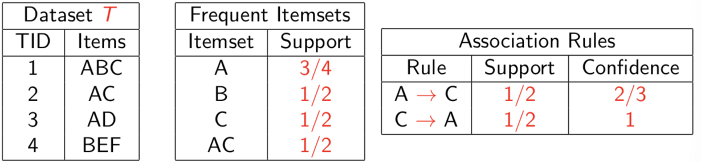
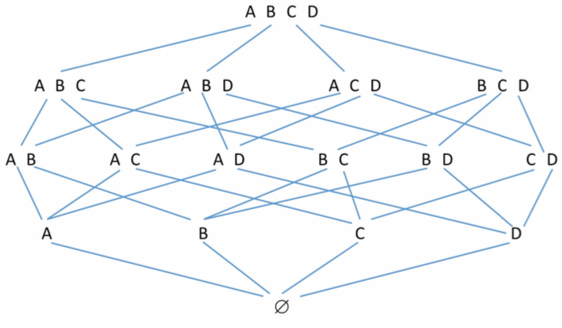
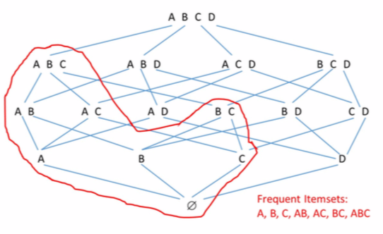
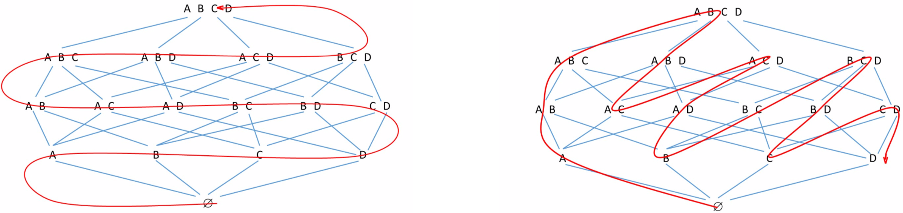

[TOC]

#Association Analysis - Notes from slides

##Market-basket analysis 

###Data:

- A large set of **items**: e.g., products sold in a supermarket.
- A large set of **baskets**: e.g., each basket represents what a customer bought in one visit to the supermarket.

### Goal: Analyze data to extract

- **Frequent itemsets:** subsets of items that occur together in a (surprisingly) high number of baskets.
- **Association rules:** correlations between subsets of items.

## Rigorous formulation of the problem

Dataset  $T={t_1, t_2, …, t_N}$ of $N$ transactions (i.e., baskets) over a set $I$ of $d$ items, with $t_i \subseteq I$, for $1 \leq i \leq N$.

### Definition: Item-set and its support

Let $X \sube I$ and let $T_X \sube T$ be the subset of transactions that contain $X$.

Then, $X$ is an **itemset** and its **support** with respect to $T$, denoted by $Supp_T(X)$, is $|T_X|/N$, that is, the *fraction* of transactions of $T$ that contain $X$. (note that $Supp_T(\O) =1$)

### Definition: Association rule and its support and confidence

An **association rule** is a rule $r : X \rarr Y$, with

- $X, Y \sub I$
- $X, Y \ne \O$
- $X \cap Y = \O$

Its **support** and **confidence** with respect to T, denoted by $Supp_T(r)$ and $Conf_T(r)$, respectively, are defined as
$$
\begin{gather}
Supp_T(r) = Supp_T(X \cup Y)\\
Conf_T(r) = Supp_T(X \cup Y)/Supp_T(X)
\end{gather}
$$
$X$ and $Y$ are called, respectively, the rule’s antecedent and consequent.

Given the dataset $T$ of $N$ transactions over $I$, and given a *support* threshold $minsup \in (0,1]$ , and a *confidence* threshold $minconf \in (0,1]$, the following two objectives can be pursued:

1. Compute all **frequent item-sets**, that is, the set of non empty item-sets $X$ such that $Supp_T(X) \geq minsup$. We denote this set by $F_{T, minsup}$.
2. Compute all interesting **association rules $r$** such that $Supp_T(r) \geq minsup$ and $Conf_t(r) \geq minconf$

### Example: (minsup=minconf=0.5)

### Observations

- **Support and confidence measures the interestingness** of a pattern (itemset or rule). In particular, the thresholds *minsup* and *minconf* define which patterns must be ragarded as **interesting**.
- Ideally, we would like that the support and confidence (for rules) of the returned patterns be **unlikely to be seen in a *random dataset***.
- The coice of *minsup* and *minconf* is crucial since it directly influences:
  - **Output size:** low thresholds may yield too many patterns (possibly exponential in the input size) which become hard to exploit effectively. 
  - **False positive/negatives:** low thresholds may yield a lot of uninteresting patterns (false positives), while high thresholds may miss some intresting patterns (false negatives).

### Applications

Association analysis is one of the most prominent data mining tasks

1. **Analysis of true market baskets.**
2. **Detection of plagiarism.**
3. **Analysis of biomarkrs.**

The mining of frequent itemsets can be generalized to search for **motifs** in biological sequences or networks; **sequential patterns**; etc.

## Potential output explosion

Let $I$ be a set of $d$ items.

$\bold{Theorem:}$ 

*The number of distinct non-empty itemsets over $I$ is $2^d-1$, while the number of distinct association rules is*  $3^d - 2^{d+1}+1$.

- Strategies that enumerate all item sets/rules in order to find the interesting ones are out of question even for ground sets $I$ of small size (say $d > 40$)
- As a first approximation, we consider efficient strategies thos that requere time/space polynomial in bot **input** and the **output** sizes. (Polinomiality only with respect to input may not be feasible if output is large)

$\bold{Proof}:$

The count of item-sets is trivial. As for the association rules, we count separately this whose antecedent has ***k*** items, for $1 \leq k < d$. There are $\bold{d \choose k}$ possible item-sets of size ***k***, and each of these, say $X$, can form a rule with $2^{d-k}-1$ distinct non-empty item sets, disjoint from $X$. Thus, the total number of rules is:
$$
\begin{align}
\sum_{k=1}^{d-1} {d\choose k} (2^{d-k}-1) &= 
\sum_{k=0}^{d-1} {d\choose k} (2^{d-k}-1) - (2^d-1) \\
&= (\sum_{k=0}^{d} {d\choose k} 2^{d-k}) -
(\sum_{k=0}^{d} {d\choose k}) - (2^d-1) \\
&= 3^d-2^d-2^d+1 = 3^d-2^{d+1} +1
\end{align}
$$
Use the fact $\sum_{k=0}^d{d \choose k}2^{d-k} = \sum_{k=0}^d{d \choose k}1^k2^{d-k} $

## Lattice of Itemsets

The family of itemsets under $\sube$ forms a **lattice**, namely a partially ordered set where for each two elements $X, Y$ there exists a unique least upper bound $(X \cup Y)$ and a unique greatest lower bound $(X \cap Y)$.

The lattice can be represented through the Hasse diagram

## Anti-monotonicity of Support

The support function for itemsets exhibits the following property, referred to as **anti-monotonicity**. For every $X, Y \sube I$
$$
X \sube Y \implies Supp(X) \geq Supp(Y)
$$
**Immediate consequence**. For a given support theshold we have:

1. $X$ is frequent $\implies \forall W \sube X$,  $W$ is frequent (*downward closure*)
2. $X$ is not frequent $\implies \forall W \supseteq X$,  $W$ is not frequent

This implies that, in the lattice, frequent itemsets form a sublattice closed downwards

## Efficient mining of Frequent Itemsets and Association Rules

### Key objectives:

- Careful eploration of the lattice of itemsets expoiting the anti-monotonicity of support
- Time/space complexities polynomial in the input and output size.

### Two phases: 

- **Phase 1:** Compute the set $F$ of all frequent itemsets with respect to minsup
- **Phase 2:**  For eace item-set $Z \in F$, compute all rules $r : X \rarr Y$, with $X \cup Y = Z$ and confidence at least minconf.

**Observation.** Phase 1 is, usually, the most demanding, computationally speaking.

### Two main approcches

**Breadth first** & **Depth first** :

## Frequent Itemset mining: A-Priori Algorithm

**A-Priori** is a popular, paradigmatic data mining algorithm devised by Agrawal and Srikant in 1994 at IBM Almaden.

It uses the breadth-first approach.

For every itemset $X \sube I$, define its absolute support (with respect to a dataset $T$ of $N$ transactions)
$$
\sigma(X) = Supp(X) \cdot N
$$
For convenience, assume the existence of a total ordering of the items, and assume that transactions/item-sets are represented as sorted vectors.

**Input** Dataset $T$ of $N$ transactions over $I$, minsup

**Output** $F_{T, minsup} = \{(X, Supp(X)) : X \sube I \and Supp(X) \geq minsup\}$
$$
\begin{multline*}
\shoveleft
\begin{aligned}
& \bold{\text{Apriori algorithm(T,  minsup)}}\\
& k \larr 1\\
& Compute\ F_1 = \{i \in I : Supp(\{i\}\ge minsup\}\\
& Compute\ O_1 = \{(X, Supp(X)) : X \in F_1\}\\
&\bold{repeat}\\
& \quad k \larr k +1 \\
& \quad C_k \larr \text{Apriori-gen}(F_{k-1})/* Candidates*/ \\
& \quad \bold{for\ each}\ c \in C_k\ \bold{do}\ \sigma(c) \larr 0 \\
& \quad \bold{for\ each}\ t \in T\ \bold{do} \\
& \quad\quad\bold{for\ each}\ c \in C_k\ \bold{do} \\
& \quad\quad\quad\bold{if}\ c \sube t\ \bold{then}\ \sigma(c) \larr \sigma(c) + 1 \\
& \quad F_k \larr \{c \in C_k : \sigma(c)\ge N \cdot minsup\} \\
& \quad O_k = \{(X, \sigma(X)/N) : X \in F_k\}\\
& \bold{until}\ F_k = \O \\
& \bold{return}\ \bigcup_{k \ge 1}O_k
\end{aligned}
\end{multline*}
$$

$$
\begin{multline*}
\shoveleft
\begin{aligned}
& \bold{\text{Apriori-gen(F)}}\\
& \text{Let}\ l-1\ \text{be the size of each itemset in}\ F\\
& \Phi \larr \O\\
& /* Candidate\ Generation */\\
& \bold{for\ each}\ X,Y \in F\ :\ X\neq Y\ \and\ X[1\dots l-2] = Y[1\dots l-2]\ \bold{do} \\
& \quad \quad \text{add}\ X \cup Y\ \text{to}\ \Phi\\
& /* Candidate Pruning */ \\
& \bold{for\ each}\ Z \in \Phi\ \bold{do} \\
& \quad \bold{for\ each}\ Y \sub Z\ : \ |Y|=l-1\ \bold{do} \\
& \quad\quad \bold{if}\ (Y \notin F)\ \bold{then}\\
& \quad\quad\quad\{remove\ Z\ from\ \Phi;\ exit\ inner\ loop\} \\
& \bold{return}\ \Phi
\end{aligned}
\end{multline*}
$$

**Observations:**

1. Candidate generation ensure that no itemset is generated twice
2. Candidate pruning removes itemsets that can be deemed **apriori** as not being frequent. This explains the name of the algorithm.

### Correctness of A-Priori

$\bold{Theorem\ (Correctness)} $

*The A-Priori algorithm for mining frequent item-sets is correct*

$\bold{Proof} $

By induction on $k \ge 1$, we show that the set $F_k$ computed by the algorithm consists of all frequent item-sets of size $k$.

- **Basis:** $k = 1$: trivial
- **Induction step:** Fix $k>1$ and assume (inductive hypothesis) the property holds up to index $k-1$. It is sufficient to prove that for an arbitrary frequent items $X$ of size $k$, $X$ is surely included in the set $C_k$ returned by $\bold{\text{Apriori-gen}(F_{k-1})}$.

Let $X = X[1]X[2]\cdots X[k]$ and define
$$
\begin{align*}
X(1) \quad &= \quad X[1]X[2]\cdots X[k-2]X[k-1]\\
X(2) \quad &= \quad X[1]X[2]\cdots X[k-2]X[k]
\end{align*}
$$
Clearly, $X = X(1) \cup X(2)$. Also, both $X(1)$ and $X(2)$ have length $k-1$ and are frequent, by anti-monotonicity of support. Thus, $X(1),\ X(2) \in F_{k-1}$, hence $X$ is added to the pool of candidates in the generation phase and cannot be aliminated in the pruning phase, since, being frequent, all of its subsets are also frequent.

### Efficiency of A-Priori

A-priori owes its popularity to a number of features that yield efficient running times especially when there aren’t many frequent item-sets.

- A <u>few passes over the dataset</u> (typically very large) are needed: namely $k_{max} + 1$ passes, where $k_{max}$ is the length of the longest frequent item-set. Note that if the number of frequent item-sets small, $k_{max}$ must also be small.
- Exploiting the anti-monotonicity of support, candidate generation are pruning ensure that <u>only a few non-frequent itemsets are ever considered and their support computed.</u>
- <u>Computing the support of the candidates</u> is usually the most time-consuming step, but it <u>can be optimized in many ways</u>.

$\bold{\text{Lemma}}$

Consider the execution of A-Priori on a dataset $T$ of transactions over a set $I$ of $d$ items with support threshold minsup, and suppose that $M$ frequent item-sets are returned at the end. Then, the various calls to **Apriori-gen** generate at most $min\{M^2,\ dM\}$ item-sets.

The lemma implies that A-Priori will compute the support of at most $d+min\{M^2, dM\}$: the $d$ individual items, and all candidates of length 2 or more.

The following theorem is an easy consequence of the lemma.

$\bold{\text{Theorem}}$

The A-Priori alorithm for mining frequent itemsets can be implemented in time polynomial in both the input size (sum of all transaction lengths) and the output size (sum of all frequent itemsets lengths)

$\bold{\text{Proof of Lemma}}$

Let  $M = \sum_{k \ge1}m_k$, where $m_k$ is the number of frequent itemsets of length $k$. Consider the invocation of $\bold{\text{Apriori-gen}(F_{k-1})}$, for some $k > 1$. By construction $\bold{\text{Apriori-gen}(F_{k-1})}$ generates less than $m^2_{k-1}$ candidates.

Moreover, each generated item-set $X = X[1] \cdots X[k-1]x[k]$ can be seen as $X’ = X[0 \div k-1] \cup \{X[k]\}$, with $X’ in F_{k-1}$ and $X[k] \in I$. This implies that for each $X’ \in F_{k-1}$ less than $d$ candidates $X’ \cup \{a\}$, with $a \in I$, are generated. Therefore, the total number of item-sets generated over all invocations of $\bold{\text{Apriori-gen}}$ is less than
$$
\sum_{k>1}min\{m^2_{k-1},\ dm_{k-1}\} \le min\{M^2,\ dM\}
$$

□

### Optimizations of A-Priori: Frequent Pairs

The **support counting** for the candidates in $C_k$, for $k \ge 2$, is typically the most time-consuming step because:

- It requires a pass over the entire dataset.
- It may use much space (the number of candidates can be quadratic in the actual number of frequent itemsets)

In practice, the issue of space, may become critical for $C_2$, which contains *all pairs of frequent items*. As $k$ grows larger, the cardinality of $F_{k-1}$, hence of $C_k$, drops.

Park, Chen and Yu devised a strategy to filter out some candidates from $C_2$ based on statistics gathered while computing $F_1$. This strategy is outilined in the following paragraph.

**Goal:** Compute $F_1$ efficiently and, at the same time, gather statistics for filtering out infrequent pairs. Consider an instance with $N$ transactions, $d$ items, and threshold minsup.

- Let $h$ be a hash function that maps pairs of items to integers in $[0, K-1]$, for a suitable value $K$.
- Use $d+K$ counters: one counter $\gamma_i$ for each $i \in I$, and a counter $\delta_j$, for every $0 \le j \le K$. Counters are initialized to 0.
- For every transaction $t$ do
  - For each item $i \in t$, increment $\gamma_i$.
  - Foe each pair of items $i_1, i_2 \in t$, increment  $\delta_{h(i_1,\ i_2)}$.
- **Key remark:** only pairs of items $i_1, i_2$ such that $\delta_{h(i_1,\ i_2)} \ge N \cdot minsup$ have a chance to be frequent.
- Compute $F_1 = \{i \in I : \gamma_i \ge N \cdot minsup \}$
- Compute $C_2$ as the set of pairs $i_1, i_2$ such that:

$$
(i_1, i_2 \in F_1)\quad AND \quad(\delta_{h(i_1,i_2)} \ge N \cdot minsup)
$$

**Observations:**

1. The first condition yields the same set of candidates as $\bold{\text{Apriori-gen}}$, while the second condition aims at filtering out some of these candidates.
2. If $K$ is chosen sufficiently large (based on the available memory), hence many pair counters are used, then filtering out of infrequent pairs become quite effective.

------

## Mining association rules

Once the frequent item-sets and they supports have been computed (set $\bigcup_{k \ge 1} O_k$ returned by A-Priori) all association rules which are based on these item-sets and satisfy the given confidence requirement can be determined.

Let minconf be the given confidence threshold. For each frequent item-set $Z$, we must determine the set:
$$
\{r : Z-Y \rarr Y : \O \ne Y \sub Z \and Conf(r) \ge minconf\}
$$
Note that each rule in the above set has the same support as $Z$, hence it automatically satisfies the support constraint since $Z$ is frequent. Conversely, rules derived from item-sets which are not frequent need not to be checked, since they would not satisfy the support constraint.

Checking all non-empty subset $Y \sube Z$ as RHS of possible rules with confidence at least minconf may be too costly. We exploit a sort of anti-monotonicity property for rules, as we did for frequent item-sets.

**Anti-monotonicity property for rules**. For $\O \ne Y’ \sub Y  \sub Z$, we have:
$$
\frac {Supp(Z)}{Supp(Z-Y)} \le \frac{Supp(Z)}{Supp(Z - Y')}
$$
 **Immediate consequence:**
$$
Conf(Z - Y' \rarr Y') < minconf \implies Conf(Z-Y\rarr Y) < minconf 
$$
Thus, for each frequent item-set $Z$ it is convenient to check rules with RHS of progressively increasing size. 

### Algorithm for mining association rules

Let $O = $ set of frequent item-set and their supports

**Input** $O$, minconf

**Output** $\{(r,\ Supp(r),\ Conf(r))\ :\ Supp(r)\ge minsup\ \and\ Conf(r) \ge minconf\}$

$$
\begin{multline*}
\shoveleft
\begin{aligned}
& \bold{\text{AssociationRuleAlgorithm(O, minconf)}}\\
& R \larr \O\\
& \bold{for\ each}\ Z\ :\ |Z|>1 \and (Z,\ support(Z)) \in O\ \bold{do} \\
& \quad R \larr R\ \cup\ \text{Ap-genrules(Z)}\\
& \bold{return}\ R
\end{aligned}
\end{multline*}
$$

$$
\begin{multline*}
\shoveleft
\begin{aligned}
& \bold{\text{Ap-genrules(Z)}}\\
& m \larr 1\\
& H_{Z,1} \larr \{Y \sub Z : |Y| = 1\ \and\ \frac {Supp(Z)}{Supp(Z-Y)} \ge minconf\}\\
& R_{Z,1} \larr \{(r,\ Supp(r),\ Conf(r))\ :\ \ r : Z - Y \rarr Y,\ \text{with}\ Y \in H_{Z,1}\}\\
&\bold{repeat}\\
& \quad\bold{if}\ (m+1=|Z|)\ \bold{then\ break}\\
& \quad m \larr m +1 \\
& \quad H_{Z,m} \larr \text{Apriori-gen}(H_{Z,m-1})\\
& \quad R_{Z, m} \larr \O\\

& \quad \bold{for\ each}\ Y \in H_{Z,m}\ \bold{do} \\
& \quad\quad\bold{if}\ c \sube t\ \bold{then} \\
& \quad\quad\quad\bold{if}\ \bigg(\frac {Supp(Z)}{Supp(Z-Y)}\ge minconf\bigg)\ \bold{then}\\
& \quad\quad\quad\quad \text{add}\ (r : Z - Y \rarr Y,\  Supp(r),\ Conf(r))\ \text{to}\ R_{Z,m} \\
& \quad\quad\quad\bold{else}\\
& \quad\quad\quad\quad \text{remove}\ Y\ \text{from}\  H_{Z,m}\\ 
& \bold{until}\ H_{Z,m} = \O \\
& \bold{return}\ \bigcup_{m \ge 1}R_{Z,m}
\end{aligned}
\end{multline*}
$$

### Example

Consider $\bold{\text{Ap-genrules(Z)}}$, with $Z = BCE$ and  $minconf = \frac{3}{4}$.  We have:
$$
\begin{align*}
H_{Z,1} &= \{E, B\}\\
R_{Z,1} &= \{(BC \rarr E,\ \frac {1}{2},\ 1),\\
&=\ \ (CE \rarr B,\ \frac {1}{2},\ 1)\}
\end{align*}
$$
Note that $C \notin H_{Z,1}$ since $Conf(BE \rarr C) $ $ = \frac{2}{3} < minconf$.

In the first iteration of the repeat, the algorithm computes $H_{Z,2}=\{BE\}$ through $\bold{\text{Apriori-gen}}$, but then it removes $BE$ from $H_{Z,2}$ since $Conf(C \rarr BE)$ $= \frac{2}{3} < minconf$. Thus, both $H_{Z,2}$ and $R_{Z,2}$ are empty at the end of the iteration, and the rules $BC \rarr E$ and $CE \rarr B$ are returned (with their supports and confidences).

### Correctness of the Association Rule algorithm

$\bold{\text{Theorem (Correctness)}}$

*The algorithm for mining association rules is correct*

□

###Efficiency of the Association Rule algorithm 

The algorithm does not require access to the dataset $T$ but only to the frequent item-sets and their supports. If the frequent item-sets are not too many, as one would hope when the support threshold is properly chosen, avoiding the access to T may yield substantial performance gains. 

The use of $\bold{\text{apriori-gen}}$ avoids that for any frequent item-set the confidence of an excessively large number of rules be checked. 

It can be easily shown that the algorithm the algorithm can be implemented in time polynomial in both the input size (sum of all frequent item-sets lengths) and output size (sum of the lengths of all returned association rules). 

------

##Frequent item-set mining for big data

When the dataset $T$ is **very large** one can follow two approaches:

1. **Partition-based approach:** Avoid multiple passes over the dataset, by **partitioning $T$ into subsets**, mining frequent item-sets independently in each subset, and combining the results.
2. **Sampling approach:** Compute the frequent item-sets from a small sample of $T$ and show that they provide a **suitable approximation** to the exact set.

### Partition-based approach 

The following 4-Round MapReduce algorithm is based on the **SON’s algorithm**.

Let $T$ be a set of $N$ transactions over a set $I$ of items, and let **minsup** be the support threshold. Assume that transactions are represented as pairs $(i, t_i)$, with $0\le i <N$, where $I$ is the Transaction ID (TID) and $t_i \sube I$ is the transaction.

Fix a suitable design parameter $K$, with $1 < K < N$.

- Round 1: Partition $T$ arbitrarily into $K$ subsets $T_0,T_1, \dots T_{K-1}$ of $O(\frac{N}{K})$ transactions each, and compute the set of frequent item-sets with respect to **minsup** independently in each subset. (Note that the same item-set can be extracted from multiple subsets.)
- Round 2: Gather all frequent itemsets computed in Round 1 and eliminate the duplicates. Call $\Phi$ the resulting set of item-sets.
- Round 3: For every $0 \le j < K$ independently do the following: gather a copy of $\Phi$ and $T_j$ that contain X (call this number $\sigma(X, j)$).
- Round 4: For each $X \in \Phi$, gather all $\sigma(X, j)$’s, compute the final support $Supp(X) = (\frac{1}{N})\sum_{j=0}^{K-1}\sigma(X,j)$ and output $X$ if $Supp(X) \ge minsup$.

#### Analysis

**Correctness:** it follows from the fact that *each item-set frequent in $T$ must be frequent in some $T_j$*. In other words, $\Phi$ contain all final frequent item-sets, although it may contain many more.

**Number of rounds:** 4.

**Space requirements:** they mainly depend on:

1. The size of $\Phi$, which cannot be easily predicted.
2. The algorithm used to extract the frequent item-sets in the first round. 

**Remark:** while the algorithm may work well in practice, it does not feature strong theoretical guarantees.

### Sampling-based approach

**Do we really need to process the entire dataset?**

No, if we are happy with some <u>approximate set of frequent item-sets</u>. (With quality of approximation under control)

$\bold{\text{Definition of Approximate frequent item-sets}}$

Let $T$ be a dataset of transactions over the set of items $I$ and $minsup \in (0,1]$ support threshold. Let also $\varepsilon > 0$ be a suitable parameter. A set $C$ of pairs $(X,s_X)$, with $X \sube I$ and $s_X \in (0,1]$, is an $\varepsilon$-approximation of the set of frequent item-sets and their supports if the following conditions are satisfied:

1. For each $X \in F_{T, minsup}$ there exist a pair $(X, s_X) \in C$
2. For each $(X, s_X) \in C$,
   - $Supp(X) \ge minsup -\varepsilon$
   - $|Supp(X)-s_X| \le \varepsilon$,
3. Where $F_{T, minsup}$ is the true set of frequent item-sets with respect to $T$ and $minsup$.

**Observations**

- Condition 1. ensures that the approximate set $C$ comprises all true frequent item-sets.
- Condition 2. Ensures that: 
  1. $C$ Does not contain item-sets of very low support
  2. For each item-set $X$ such that $(X, s_X) \in C, s_X$ is a good estimate of its support.

#### Simple algorithm

Let $T$ be a dataset of $N$ transactions over $I$, and $minsup \in (0,1]$ a support threshold. Let also $\theta(minsup) < minsup$ be a suitably lower support threshold.

1. Let $S \sube T$ be a simple drawn at random with uniform probability and with replacement

2. Return the set of pairs
   $$
   C = \{(X, s_X = Supp_S(X))\ :\ X \in F_{S,\theta(minsup)}\}
   $$
   Where $F_{S, \theta(minsup)}$ is the set of frequent item-sets with respect to $S$ and $\theta(minsup)$.

**How well does $C$ approximate the true frequent item-sets and their supports?**

$\bold{\text{Theorem (Riondato-Upfal)}}$

*Let $h$ be the maximum transaction length and let $\varepsilon, \delta$ be suitable design parameters in $(0,1)$. There is a constant $c > 0$ such that if*
$$
\begin{align}
&\theta(minsup) = minsup -\frac{\varepsilon}{2}\quad\\
& \text{AND}\quad \nonumber\\
&|S| = \Omega\bigg(\frac{1}{\varepsilon^2}\bigg(h+log\frac{1}{\delta}\bigg)\bigg)=
\frac{4c}{\varepsilon^2}\bigg(h+log\frac{1}{\delta}\bigg)
\end{align}
$$
*Then it with probability at least $1-\delta$ the set $C$ returned by the algorithm is an $\varepsilon$-approximation of the set of frequent item-sets and their supports.*

**Considerations:**

C is a $\varepsilon$-approximation of $C_{exact}$ 

- $\forall X \in F_{T,minsup} \quad (X,S_X) \in C\ \Longrightarrow$ No false negatives
- $\forall (X,S_X) \in C$
  - $Supp_T(X) \ge minsup -\varepsilon$
  - $|Supp_T(X)-S_X \le \varepsilon$

The result stats in the theorem relies on the following lemma which can be proved thorough an elegant exploitation of the notion of **VC-dimension**.

$\bold{\text{Lemma}}$

*Using the sample size |S| specified in the above theorem, the algorithm ensures that with probability $\ge 1-\delta$ for each item-set $X$ it holds that $|Supp_T(X)-Supp_S(X)|\le\frac{\varepsilon}{2}$.*

$\bold{\text{Proof of Theorem (Riondato-Upfal)}}$

By using the result stated in the lemma we have that:

- For each frequent item-set $X \in F_{T, minsup}$
  $$
  Supp_S(X) \ge Supp_T(X)-\frac{\varepsilon}{2} \ge minsup -\frac{\varepsilon}{2} \triangleq \theta(minsup)
  $$
  hence, the pair $(X, s_X = Supp_S(X))$ is returned by the algorithm;

- For each pair $(X, s_X = Supp_S(X))$ returned by the algorithm

  - $Supp_T(X) \ge s_X -\frac{\varepsilon}{2}\ge\theta(minsup)-\frac{\varepsilon}{2}\ge minsup-\varepsilon$
  - $|Supp_T(X)-s_X| \le \frac{\varepsilon}{2} < \varepsilon$

Hence, the output of the algorithm is an $\varepsilon$-approximation of the true frequent item-sets and their supports. 

□

**Observations:**

1. The size of the sample is <u>independent</u> of the support threshold minsup and of the number $N$ of transactions. It only depends on the approximation guarantee embodied in the parameters $\varepsilon$, $\delta$, and on the max transaction length $h$, which is often quite low.
2. Tighter bounds on the sample size are known.
3. The sample-based algorithm yields a 2-round MapReduce algorithm: in first round the sample of suitable size is extracted; in the second round the approximate set of frequent item-sets is extracted from the sample (e.g., through A-Priori) within one reducer. 

## Limitations of the Support/Confidence framework

1. **Redundancy**: many returned patterns may characterize the same subpopulation of data (e.g, transactions/customers).
2. **Difficult control of output size**: it is hard to predict how many patterns will be returned for given support/confidence thresholds.  
3. **Significance**: are the returned patterns significant, interesting?

In what follows we will address the first two issues above, limiting the discussion to frequent item-sets. Some of the ideas can be extended to association rules.

## Closed itemsets

**Goal**: Devise a losses succinct representation of the frequent item-sets.

Consider a dataset $T$ of $N$ transactions over the set of items $I$, and a support threshold **minsup**.

$\bold{\text{Definition (Closed Item-set)}}$

An item-set $X \sube I$ is *closed* with respect to $T$ if for each superset $Y \supset X$ we have $Supp(Y) < Supp(X)$.

In other words, $X$ is closes if as soon as an item is added to it, its support decreases.

**Notation**:

- $CLO_T = \{X \sube I : X\ \text{is closet with respect to}\ T\}$ (Set of closed item-sets)
- $CLO-F_{T,\text{minsup}}=\{X \in CLO_T : Supp(X) \ge \text{minsup}\}$

$\bold{\text{Definition (Maximal Item-set)}}$

