#Clustering

## Definition

Given a **set of points** belonging to some **space**, with a notion of **distance** between points, **clustering** aims at groping the point into a number of subsets (**clusters**) such that:

- Points in the same cluster are “**close**“ to one another.
- Points in different clusters are “**distant**” from one another.

The **distance** captures a notion of **similarity**: close points are similar, distant point are dissimilar.

A **clustering problem** is usually defined by requiring that clusters optimize a given **objective function**, and/or satisfy certain **properties**. Numerous clustering problems have been defined, studied and employed in applications over the years.

## Metric Space

Typically, the input of a clustering problem consist of a set of points from a **metric space**.

$\bold{\text{Definition}}$

A  **Metric space** is an ordered pair $(M, d)$ where $M$ is a set ad $d(\cdot)$ is a **metric** on $M$, i.e, a function:
$$
d : M \times M \rarr \R
$$

Such that for every $x,y,z \in M$ the following holds:

- $d(x,y) \ge 0$
- $d(x,y) = 0$ If and only if $x = y$
- $d(x,y) = d(y,x)$ Symmetry
- $d(x,z) \le d(x,y) + d(y,z)$ Triangle inequality

**Remark:** Often, different distance functions can be used to analyze a dataset through clustering . The choice of the function may have a significant impact on the effectiveness of the analysis.

## Distance functions

### Euclidean distance

Let $X,Y \in \R^n$, with $X = (x_1, x_2, \dots, x_n)$ and $Y=(y_1,y_2,\dots, y_n)$. For $r \ge 1$ the $L_r-$ distance between $X$ and $Y$ (a.k.a. $L_r-$norm)
$$
d_{Lr}(X,Y) = \bigg(\sum^n_{i=1}|x_i-y_i|^r\bigg)^{1/r}
$$

- $r = 2$: Standard distance in $\R^n$ (also denoted by $|| \cdot||$)

- $r = 1$: Referred to as *Manhattan distance*, it is the sum of the absolute differences of coordinates in each dimension. Used in grid-like environments.

- $r= \infty$: (Limit for $r$ that tends to $\infty$) it is the maximum absolute differences of coordinates, over all dimensions.  

  

  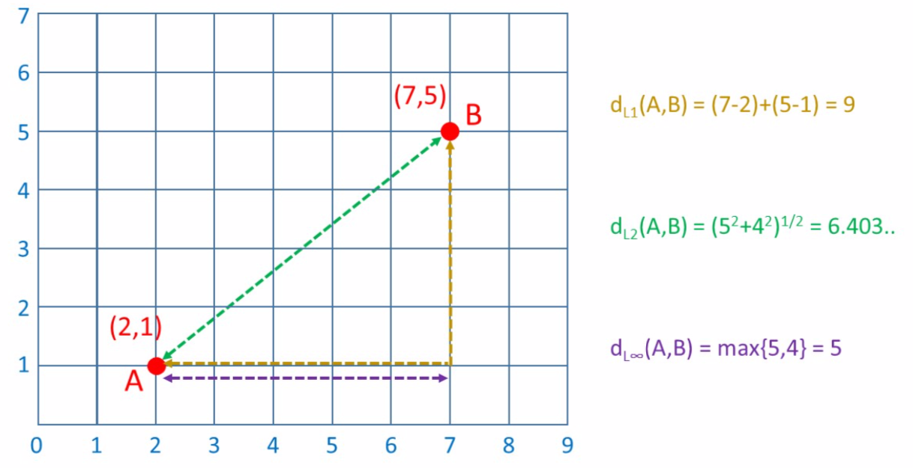 

### Jaccard distance

Used when points are *sets* (e.g documents seen as bag of words). Let $S$ and $T$ be two sets over the same ground set of elements. The **Jaccard distance** between $S$ and $T$ is defined as:
$$
d_{Jaccard}(S,T) = 1 - \frac{|S \cap T|}{|S \cup T|}
$$
Note that the distance ranges in $[0,1]$ and it is $0$ iff $S=T$ and 1 iff $S$ and $T$ are disjoint. The value $\frac{|S \cap T|}{|S \cup T|}$ is referred to as the *Jaccard similarity* of the two sets.

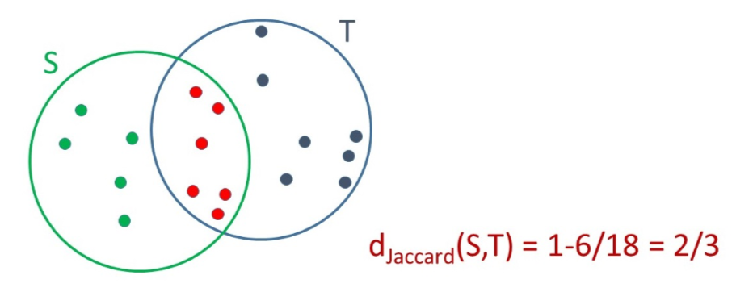

### Cosine (or angular) distance

It is used when points are *vectors* in $\R^n$ (or, in general in an inner-product space). Given two vectors $X = (x_1, x_2, \dots, x_n)$ and $Y=(y_1,y_2,\dots, y_n)$ in $R^n$, their **cosine distance** is the angle between them, that is:
$$
d_{cosine} = 
arcos\bigg(\frac{X\cdot Y}{||X||\cdot ||Y||}\bigg)=
arcos\bigg(\frac{\sum_{i=1}^nx_iy_i}
{\sqrt{\sum_{i=1}^n(x_i)^2}\sqrt{\sum_{i=1}^n(y_i)^2}}\bigg)
$$
**Example:** For $X=(1,2,-1)$ and $Y=(2,1,1)$ the cosine distance is:
$$
arcos\bigg(\frac{3}{\sqrt{6}\sqrt{6}}\bigg)=
arcos\bigg(\frac{1}{2}\bigg)=
\frac{\pi}{3}
$$
**Remark:** The cosine distance is often used in **information retrieval** to assess similarity between documents. Consider an alphabet of $n$ words. A document $X$ over this alphabet can be represented as an $n-Vector$, where $x_i$ is the number of occurrences in $X$ of the $i$-th word of the alphabet.

#### Observations on the cosine distance

For non-negative coordinates it takes values in $[0, \pi/2]$ while for arbitrary coordinates the range is $[0, \pi]$. Dividing by $\pi/2$ (or $\pi$) the range becomes $[0,1]$.

In order to satisfy the second property of distance functions for metric spaces scalar multiples of a vector must be regarded as the same vector.

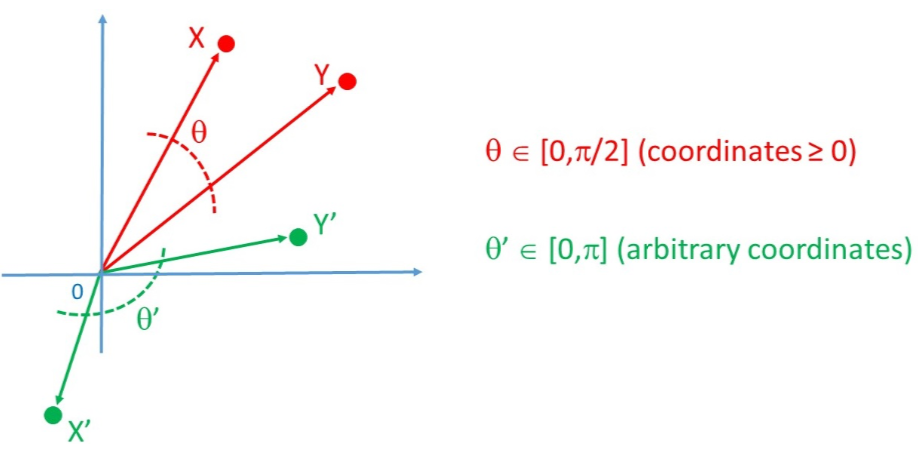

### Edit distance

Used for strings. Given two strings $X$ and $Y$, their **edit distance** is the minimum number of delation and insertions that must be applied to transform $X$ into $Y$.

**Example:** for $X=ABCDE$ and $Y=ACFDEG$, we have $d_{edit}(X,Y) = 3$, since we can transform $X$ into $Y$ as follows:
$$
ABCDE\ \mathop{\longrightarrow}^{delete\ B}\ 
ACDE\ \mathop{\longrightarrow}^{insert\ F}\ 
ACFDE\ \mathop{\longrightarrow}^{insert\ G}\ 
ACFDEG
$$
and less than 3 deletions/insertions cannot be used.

#### Equivalent definition

Given strings $X$ and $Y$, let their **Longest Common Subsequence** ($LCS(X,Y)$) be the longest string $Z$ whose characters occur in both $X$ and $Y$ in the same order but not necessarily contiguously. For example:
$$
LCS(ABCDE,ACFDEG)=ACDE
$$
It is easy to see that:
$$
d_{edit}(X,Y)=|X|+|Y|-2|LCS(X,Y)|
$$
$LCS(X,Y) $ can be computed in $O(|X|\cdot |Y|)$ time through dynamic-programming.

### Hamming distance

Used when points are *vectors* (as for cosine distance) over some $n$-dimensional space. Most commonly, it is used for binary vectors. The **Hamming distance** between two vectors is the number of coordinates in which they differ.

**Example:** for $X=(0,1,1,0,1)$ and $Y=(1,1,1,0,0)$  (i.e, $n=5$)
$$
d_{Hamming}(X,Y)=2
$$
Since they differ in the first and last coordinates.

## Curse of dimensionality

Random points in a high-dimensional metric space tend to be 

- Sparse.
- Almost equally distant from one another.
- Almost orthogonal (as vectors) to one another.

As consequence, in high dimensions distance functions may loose effectiveness in assessing similarity/dissimilarity. However, this holds in particular when points are random, and it might be less of a problem in some real-world datasets.

## Types of clusterings

Given a set of points in a metric space, hence a distance between points, a clustering problem often specifies an **objective function** to optimize. The objective function also allows to compare different solutions.

Objective functions can be categorized based on whether or not:

- A target number $k$ of clusters is given in input.

- For each cluster a **center** must be identified.

  When centers are required, the value of the objective function depends on the selected centers. Cluster centers must belong to the underlying metric space but, sometimes, they are constrained to belong to the input set.

- **Disjoint clusters** are sought.

## Background

### Combinatorial optimization problem

A (combinatorial) optimization problem is a computational problem $\Pi(I, S, \Phi,m)$ defined by a set of *instances* $I$, a set of *solutions* $S$, an *objective function* $\Phi$ that assigns a real value to each solution $s \in S$ , and $m \in \{\min, \max\}$. For each instance $i\in I$ the problem require to find an *optimal solution*, namely a feasible solution $s\in S$, which **minimizes $\Phi(s)$** if $m = \min$ (minimization problem), or  **maximizes $\Phi(s)$**, if $m=\max$ (maximization problem)

**Observation:** For several important optimization problems no algorithms are known which find an optimal solution in time polynomial in the input size, and it is unlikely that such algorithms exist (***NP-hard problems***). Therefore, especially when thinking of big data, one has to aim at approximations of optimal solutions.

####Approximation algorithm

For $c \ge 1$, a **$\bold{c}$-approximation algorithm $A$** for a combinatorial optimization problem  $\Pi(I, S, \Phi,m)$  is an algorithm that for each instance $i \in I$ returns a feasible solution $A(i) \in S_i$ such that $\Phi(A(i)) \le c\min_{s\in S_i}\Phi(s)$, if $m = \min$, or $\Phi(A(i)) \ge (1/c)\max_{s\in S_i}\Phi(s)$, if $m = \max$. The value $c$ is called **approximation ratio**, and the solution $A(i)$ is called **$\bold{c}$-approximate solution** or **$\bold{c}$-approximation**.

**Observation:** the approximation introduces a flexibility in selecting the solution to a given instance, which algorithms can exploit to run more efficiently.

## Center-based clustering 

Let $P$ be a set of $N$ points in metric space $(M,d)$, and let $k$ be the target number of clusters, $1 \le k \le N$. We define a $k\text{-clustering}$ of $P$ as a tuple $C=(C_1,C_2,\dots,C_k;c_1,c_2,\dots,c_k)$ where:

- $(C_1,C_2,\dots,C_k)$ Defines a partition of $P$ i.e, $P=C_1\cup C_2 \cup\dots\cup C_k$ 
- $c_1,c_2,\dots,c_k$ Are suitably selected **centers** for the clusters, where $c_i \in C_i$ for every $1 \le i \le k$

Observe that the above definition requires the centers to belong to the clusters, hence to the pointset. Whenever appropriate we will discuss the case when the centers can be chosen more freely from the metric space.

$\bold{\text{Definition}}$

Consider a metric space $(M,d)$ and an integer $k>0$. A $k$-clustering problem for $(M,d)$ is an optimization problem whose instances are the finite point sets $P \sube M$. For each instance $P$, the problem requires to compute a $k$-clustering $C$ of $P$ (feasible solution) which **minimizes** a suitable objective function $\Phi(C)$.

The following are three popular objective functions.

- $\Phi_{kcenter}(C) = \max^k_{i=1}\max_{a \in C_i} d(a, c_i)$ 		(**k-center clustering**)
- $\Phi_{kmeans}(C) = \sum^k_{i=1}\sum_{a \in C_i} (d(a, c_i))^2$ 	 	(**k-means clustering**)
- $\Phi_{kcenter}(C) = \sum^k_{i=1}\sum_{a \in C_i} d(a, c_i)$ 			(**k-median clustering**)

In other words, under the above functions, the problem requires to find the $k$-clustering that minimizes, respectively, the maximum distance (k-center), or the average square distance (k-means), or the average distance (k-median) of a point to its cluster center.

### Observations

- All aforementioned problems (k-center, k-means, k-median) are ***NP-hard***. Hence, in general it is impractical to search for optimal solutions.
- There are several efficient approximation algorithms that in practice return good-quality solutions. However, dealing efficiently with large inputs is still a challenge! 
- K-center and k-median belong to the family of **facility-location problems**. In these problems, a set $F$ of candidate *facilities* and a set $C$ of clients are given and the objective is to find a subset of at most $k$ candidate facilities to open and an assignment of clients to them, so to minimize some the maximum or average distance between a client and its assigned facilities. In our formulation, each input point represents both a facility and a client. Numerous variants of these problems have been studied in the literature. 
- k-means objective is also referred to as Sum of **Squared Errors (SSE).**

### Notations

Let $P$ be a point-set from a metric space $(M,d)$. For every integer $k \in [1, |P|]$ we define:

- $\Phi^{opt}_{kcenter}(P,k)$ = Minimum value of $\Phi_{kcenter}(C)$ over all possible $k$-clustering $C$ of $P$.

- $\Phi^{opt}_{kmeans}(P,k)$ = Minimum value of $\Phi_{kmeans}(C)$ over all possible $k$-clustering $C$ of $P$.
- $\Phi^{opt}_{kmedian}(P,k)$ = Minimum value of $\Phi_{kmedian}(C)$ over all possible $k$-clustering $C$ of $P$.

Also, for any point $p \in P$ and any subset $S \sube P$ we define;
$$
d(p,S) = \min\{q \in S : d(p,q)\}
$$
Which generalizes the distance function to distances between points and sets.

## Partitioning primitive

Let $P$ be a point-set and $S \sube P$ a set of $k$ selected centers. For *all* previously defined clustering problems, the best $k$-clustering around these centers is the one where each $c_i$ belongs to a distinct cluster and each point is assigned to the cluster of the closest $c_i$ (ties broken arbitrarily).

We will use primitive $\bold{\text{Partition(P,S)}}$ to denote this task:
$$
\begin{multline*}
\begin{aligned}
& \bold{\text{Partition(P,S)}}\\
&\text{Let}\ S=\{c_1,c_2,\dots, c_k\} \sube P \\
&\bold{\text{for}}\ i\larr 1\ \bold{\text{to}}\ k\ \bold{\text{do}}\ C_i\larr\{c_i\}\\
&\quad l \larr \text{argmin}_{i=1,k}\{d(p,c_i)\}\quad //\ ties\ broken\ arbitrarily\\
&\quad C_l \larr C_l \cup\{p\}\\
&C \larr (C_1,C_2,\dots, C_k;c_1,c_2,\dots,c_k)\\
&\bold{\text{return}}\ C
\end{aligned}
\end{multline*}
$$

## K-Center Clustering

### Farthest-First Traversal

#### Algorithm

It is a popular 2-approximation sequential algorithm developed by T.F. Gonzales. Simple and, somewhat fast, implementation when the input fits in main memory. Powerful primitive for extracting samples for further analyses.

$\bold{\text{Input}}$ Set $P$ of $N$ points from metric space $(M,d)$, integer $k > 1$

$\bold{\text{Output}}$ $k$-clustering $C=(C_1,C_2,\dots,C_k;c_1,c_2,\dots,c_k)$ of $P$ which is a good approximation to the $k$-center problem for P.
$$
\begin{multline*}
\begin{aligned}
& \bold{\text{Farthest-First Traversal(P)}}\\
&S \larr \{c_1\}\quad //c_1 \in P\ arbitrary\ point \\
&\bold{\text{for}}\ i\larr 2\ \bold{\text{to}}\ k\ \bold{\text{do}}\\
&\quad \text{Find the point}\ c_i\in P - S\ \text{that maximizes}\ d(c_i,S)\\
&\quad S \larr S \cup \{c_i\}\\
&\bold{\text{return}}\ \text{Partition(P,S)}
\end{aligned}
\end{multline*}
$$
**Observation:** The invocation of $\bold{\text{Partition(P,S)}}$ at the end can be avoided by maintaining the best assignment of the points to the current set of centers in every iteration of the for-loop.

**Example:**

<table>
  <tr>
    <td>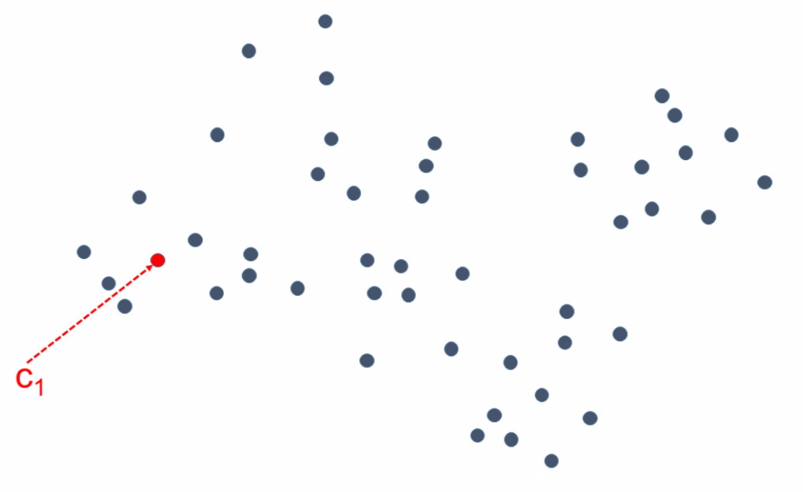</td>
    <td>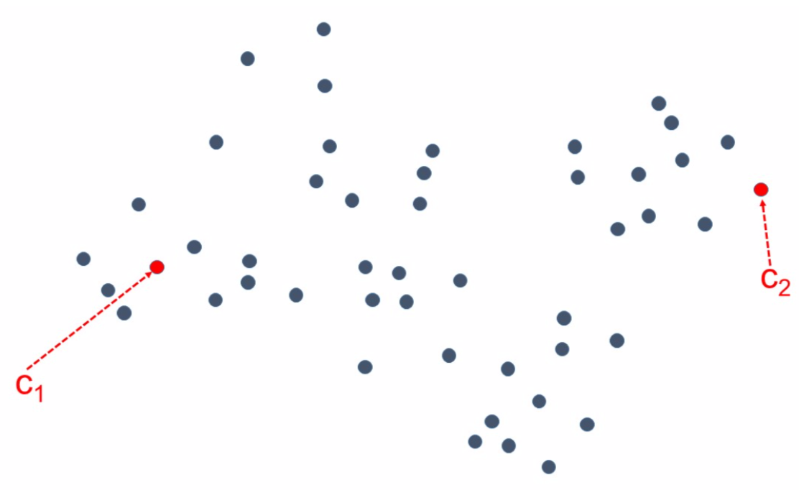</td>
  </tr>
  <tr>
    <td>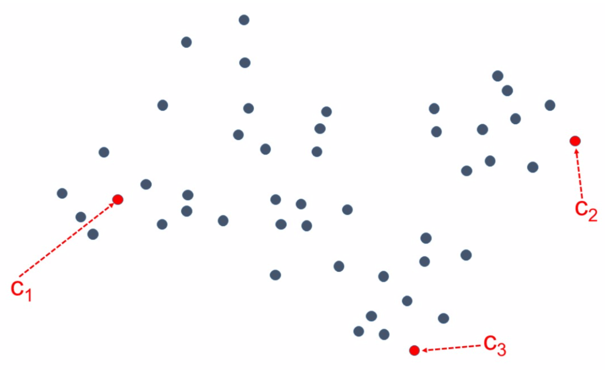</td>
    <td>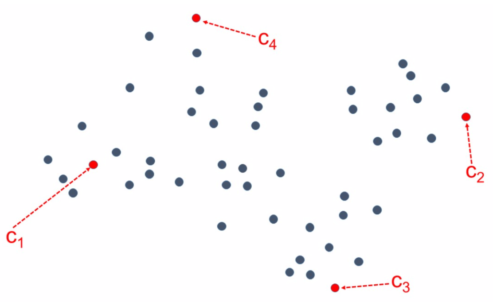</td>
  </tr>
    <tr>
    <td>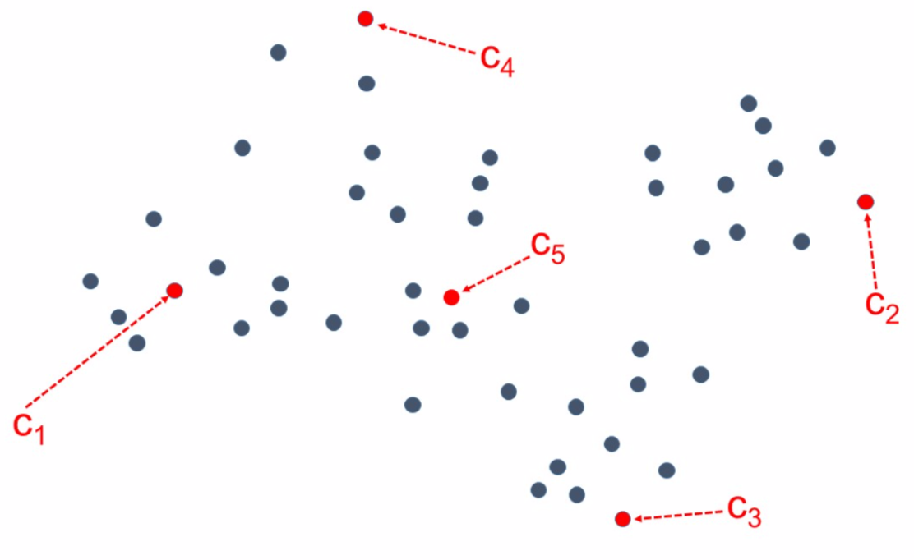</td>
    <td>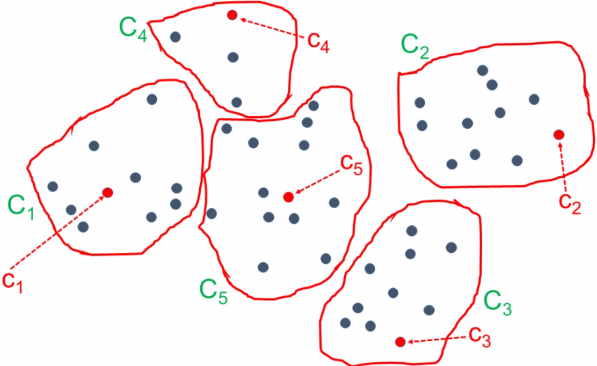</td>
  </tr>
</table>

#### Analysis

$\bold{\text{Theorem}}$

*Let $C_{alg}$ be the $k$-clustering of $P$ returned by the Farthest-First Traversal algorithm. Then:*
$$
\Phi_{kcenter}(C_{alg})\le 2 \cdot \Phi_{kcenter}^{opt}(P,k)
$$
*That is, Farthest-First Traversal is a 2-approximation algorithm.*

$\bold{\text{Proof}}$

Let $S=\{c_1,c_2,\dots,c_k\}$ be the set of centers returned by Farthest-Fist Traversal with input $P$, and let $S_i=\{c_1,c_2,\dots,c_i\}$ be the partial set of centers determined up to iteration $i$ of the for-loop, with $2 \le i \le k$.

It is easy to see that:
$$
\begin{align}
d(c_i, S_{i-1})\quad &\le \quad d(d_j,S_{j-1})\ \forall2 \le j < i \le k \\
d(p, S_{i-1})\quad &\le \quad d(d_j,S_{j-1})\ \forall p \in P - S_{i-1}\ \text{and}\ \le j < i \le k
\end{align}
$$
Let $q$ be the point with maximum $d(q,S)$ (i.e, distance between $q$ and the closest center). Therefore, $\Phi_{kcenter}(C_{alg})=d(q,S)=d(q,S_k)$. Let $c_i$ be the closest center to $q$, that is, $d(q,S)=d(q, c_i)$.

We now show that the $k+1$ points $c_1,c_2,\dots,c_k,q$ are such that any two go them are at distance at least $\Phi_{Kcenter}(C_{alg})$ from one another.

Indeed, since we assumed $c_i$ to be the closest center to $q$, we have:
$$
\Phi_{kcenter}(C_{alg})=d(q,c_i)\le d(q,c_j)\quad \forall j\ne i
$$
Also, by Inequalities (12) and (13), we have that for any pair of indices $j_1,j_2$, with $1 \le j_1 < j_2 \le k$,
$$
\Phi_{kcenter}(C_{alg})=d(q,S_k)\le d(c_k,S_{k-1}) \le d(c_{j_2}, S_{j_2-1}) \le d(c_{j_2}, c_{j_1})
$$
Now we know that all pairwise distances between $c_1,c_2,\dots,c_k, q$ are at least $\Phi_{kcenter}(C_{alg})$. Clearly, by the *pigeonhole principle*, two of these $k+1$ points must fall in the same cluster of the optimal clustering.

Suppose that $x,y$ are two points in $\{c_1,c_2,\dots,c_k,q\}$ which belong to the same cluster of the optimal clustering with center $c$. By the triangle inequality, we have that:
$$
\Phi_{kcenter}(C_{alg})\le d(x,y)\le d(x,c) + d(c,y)
\le 2 \Phi^{opt}_{kcenter}(P,k),
$$
and the theorem follows. 

□
 

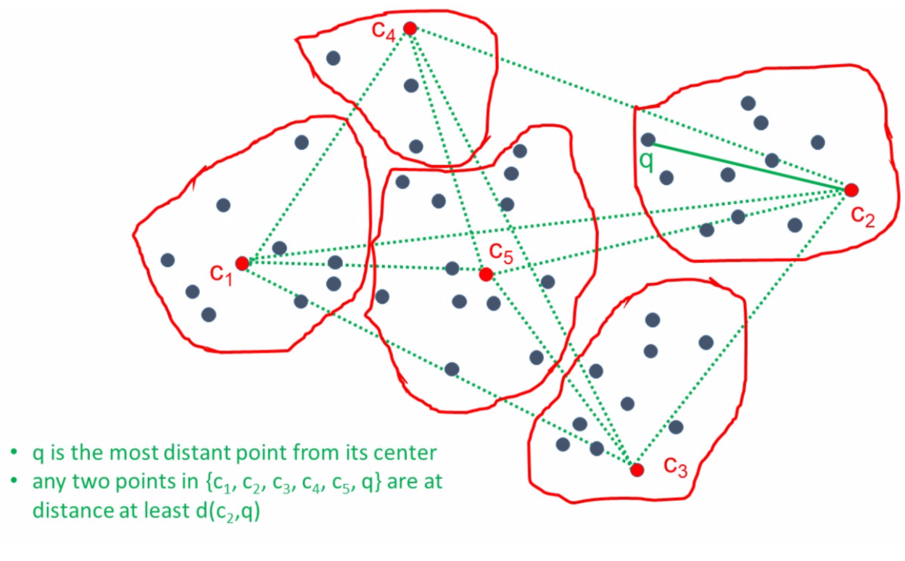

### Observations on k-center clustering

- K-center clustering provides a strong guarantee on how close **each** point is to the center of its cluster.

- However, for **noisy point-sets** (e.g,  **point-sets whit outliers**) the clustering which optimizes the $k$-center objective may obfuscate some “natural” clustering inherent in the data.

- For any fixed $\epsilon > 0$ it is NP-hard to compute a $k$-clustering $C_{alg}$ of a points $P$ with
  $$
  \Phi_{kcenter}(C_{alg})\le (2-\epsilon)\Phi^{opt}_{kcenter}(P,k)
  $$
  Hence the Farthest-First Traversal is likely to provide almost the best approximation guarantee obtainable in polynomial time.

### K-center clustering for big data

*How can we compute a “good” k-center clustering of a points $P$ ​that is too large for a single machine?*

We empty a **coreset-based approach**:

1. Extract from $P$ a small $T$ (**coreset**) of representatives.
2. Compute within $T$ the set $S$ of $k$ cluster centers.
3. Compute the final clustering around the centers of $S$.

**Observations:**

- The core-set-based approach is effective when Steps 1 and 3 can be performed efficiently (e.g., in parallel), and from the core-set $T$ a good set of centers can be extracted.
- Coresets are used to confine computations on small instances when they are too expensive to run on the whole input. 
- A coreset needs not be a simple subset of the input. 

### MapReduce-Farthest-First Traversal

Let $P$ be a set of $N$ points ($N$ large!) from a metric space $(M,d)$, and let $k > 1$ be an integer. The following MapReduce algorithm, computes a good k-center clustering.

- Round 1: Partition $P$ arbitrarily in $\ell$ subset of equal size $P_1,P_2,\dots,P_{\ell}$ and execute the Farthest-First Traversal algorithm on each $P_i$ separately and determine a set $T_i$ of $k$ centers, for $1 \le i \le \ell$.
- Round 2: Gather the **coreset** $T=\bigcup_{i=1}^\ell T_i$ (of size $\ell \cdot k$) and run, using a single reducer, the Farthest-First Traversal algorithm on $T$ to determine a set $S=\{c_1,c_2,\dots,c_k\}$ of $k$ centers.
- Round 3: Execute ${\text{Partition(P, S)}}$.

#### Analysis

Assume $k = o(N)$. By setting $\ell = \sqrt{N/k}$, it is easy to see that the 3-round MR-Farthest-First traversal algorithm uses

- Local space $M_L = O(\sqrt{N\cdot k})$= $o(N)$ 					
- Aggregate space $M_A=O(N)$	 					 				 			 		

$\bold{\text{Theorem}}$

*Let $C_{alg}$ be the $k$-clustering of $P$ returned by the MR-Farthest-First Traversal algorithm. Then:*
$$
\Phi_{kcenter}(C_{alg}) 
\le 4 \cdot \Phi_{kcenter}^{opt}(P,k)
$$
*That is, MR-Farthest-First Traversal is a 4-approximation algorithm.*

$\bold{\text{Proof}}$

For $1 \le i \le \ell$, let $d_i$ be the maximum distance of a point of $P_i$ from the centers $T_i$ determined in Round 1.

By reasoning as in the proof of the previous theorem, we can show that there exist $k+1$ points in $P_i$ whose pairwise distances are all $\ge d_i$. At least two such points, say $x,y$ must belong to the same cluster of the optimal clustering for $P$ (not $P_i$!), with center $c$. Therefore:
$$
d_i \le d(x,y) \le d(x,c)+d(c,y) \le 2\Phi^{opt}_{kcenter} (P,k)
$$
Consider now the set of center $S$ determined in Round 2 from the coreset $T$, and let $d_T$ be the maximum distance of a point of $T$ from $S$. The same argument as above shows that $d_T \le 2 \Phi^{opt}_{kcenter}(P,k)$.

Finally, consider an arbitrary point $p \in P$ and suppose that $p \in P_i$, for some $1 \le i \le \ell$. By virtue of the two inequalities derived previously, we know that there must exist a point $t \in T_i$ (hence $t \in T$) and a point $c \in S$, such that:
$$
\begin{align}
d(p,t)\ &\le\ 2 \Phi_{kcenter}^{opt}(P,k)\\
d(t,c)\ &\le\ 2 \Phi_{kcenter}^{opt}(P,k)
\end{align}
$$
Therefore, by triangle inequality, we have that
$$
d(p,c)\le d(p,t) + d(t,c) \le 4 \Phi^{opt}_{kcenter}(P,k)
$$
And this immediately implies that $\Phi_{kcenter}(C_{alg})\le 4 \cdot \Phi^{opt}_{kcenter} (P,k)$.

□

#### Observations

- The sequential Farthest-First Traversal algorithm is used both to extract the coreset and to compute the final set of centers. It provides a good core-set since it ensures that any point not in the core-set be well represented by some core-set point. 
- The main feature of MR-Farthest-First Traversal is that while only small subsets of the input are processed at once, and many of them in parallel, the final approximation is not too far from the best achievable one. 
- By selecting $k′ > k$ centers from each subset $P_i$ in Round 1, the quality of the final clustering improves. In fact, it can be shown that when $P$ satisfy certain properties and $k′$ is sufficiently large, MR-Farthest-First Traversal returns a $(2 + \varepsilon)$-approximation for any constant $\varepsilon > 0$, still using sub-linear local space and linear aggregate space. 

## K-means clustering

### Definition and observations

Given a points $P$ from a metric space $(M,d)$ and an integer $k > 0$, the **$k$-means clustering** problem requires to determine a $k$-clustering $C=(C_1,C_2,\dots C_k;c_1,c_2,\dots, c_k)$ which minimizes:
$$
\Phi_{kmeans}(\mathcal{C}) = 
\sum^k_{i=1}\sum_{a \in C_i}(d(a,c_i))^2
$$
**Observations:**

- K-means clustering aims at **minimizing cluster variance**, and works well for discovering ball-shaped clusters.
- Because of the quadratic dependence on distances, k-means clustering is **rather sensitive to outliers** (though less than k-center).
- Some established algorithms for k-means clustering **perform well in practice** although only recently a rigorous assessment of their performance-accuracy tradeoff has been carried out.

### Aim

Our aim for this tipe of clustering is to work on **Euclidean spaces** $\R^D$ with the **unrestricted version** of the problem where **center need not belong to input** $P$.

We will review popular, state-of-the-art algorithms and critical assessment of they suitability for a big data scenario.

We will also study novel 2-round core-set-based Map-Reduce algorithms.

###Properties of Euclidean spaces

Let $X = (X_1,X_2, \dots, X_D)$ and $Y = (Y_1,Y_2, \dots, Y_D)$ be two points in $\R^D$. Recall that their Euclidean distance is 
$$
d(X,Y) = \sqrt{\sum_{i=1}(X_i-Y_i)^2} \triangleq ||X-Y||
$$

#### Centroid

$\bold{\text{Definition}}$

The **centroid** of a set $P$ of $N$ points in $\R^D$ is:
$$
c(P) = \frac 1 N \sum_{X \in P} X
$$
where the sum is component-wise.

Observe that $c(P)$ does not necessarily belong to $P$

$\bold{\text{Lemma}}$

*The **centroid ** $c(P)$ of a set $P \sub \R^D$ is the point of $R^D$ which minimizes the sum of the square distances to all points of $P$.*

$\bold{\text{Proof}}$

Consider an arbitrary point $Y \in \R^D$. We have that
$$
\begin{align}
\sum_{X \in P}(d(X,Y))^2\quad &= \quad
\sum_{X \in P}||X-Y||^2\\
&=\quad \sum_{X \in P}||X - c_P +c_P -Y||^2\\
&=\quad (\sum_{X \in P}||X - c_P||)^2 + N||c_P-Y||^2 \\
&\quad\quad+ 2(c_P - Y) \cdot \bigg(\sum_{X\in P}(X-c_P)\bigg)\nonumber
\end{align}
$$
Where “$\cdot$“ denotes the inner product.

By definition of $c_p$ we have that $\sum_{X \in P}(X - c_P) = (\sum_{X \in P}X) -N_{c_P}  $ is the all-0’s vector, hence:
$$
\begin{align}
\sum_{X \in P}(d(X,Y))^2\quad &= \quad
\sum_{X \in P}||X-c_P||^2 + N||c_P-Y||^2\\
&\ge\quad \sum_{X \in P}||X - c_P||^2\\
&=\quad (\sum_{X \in P}(d(X,c_P))^2 \\
\end{align}
$$

□

**Observation:** The lemma implies that when seeking a $k$-clustering for points in $\R^D$ which minimizes the **kmeans** objective, the best center to select for each cluster is its centroid (assuming that centers need not necessarily belong to the input point-set).

###Lloyd’s algorithm

Also known as **k-means algorithm**, it was developed by Stuart Lloyd in 1957 and become (one of) the most popular algorithm for unsupervised learning.

In 2006 it was listed as one of the top 10 most influential data mining algorithms.

It relates to a generalization of the Expectation-Maximization algorithm.

$\bold{\text{Input}}$: Set $P$ of $N$ points from $\R^D$, integer $k > 1$

$\bold{\text{Output}}$: $k$-clustering $\mathcal{C} = (C_1,C_2,\dots,C_k;c_1,c_2,\dots cC_k)$ of $P$ with small $\Phi_{kmeans}(\mathcal{C})$. Centers need not to be in $P$.
$$
\begin{multline*}
\begin{aligned}
& \bold{\text{Lloyd(P, k)}}\\
1.\ & S\larr \text{arbitrary set of}\ k \text{ points in } \R^D\\
2.\ & \Phi \larr \infty\\
3.\ & \text{stopping-condition } \larr \text{false} \\
4.\ &\bold{\text{while}} \text{ (!stopping-condition)} \bold{\text{ do}}\\
5.\ &\quad(C_1,C_2,\dots,C_k; S) \larr \text{Partition(P,S)}\\
6.\ &\quad \bold{\text{for }} i\larr 1 \bold{\text{ to }} k \bold{\text{ do }} c'_i \larr \text{ centroid of } C_i \\
7.\ &\quad \mathcal{C} \larr (C_1,C_2,\dots,C_k; c'_1,c'_2,\dots,c'_k)\\
8.\ &\quad \bold{\text{if }} \Phi_{kmeans}(\mathcal{C}) < \Phi \bold{\text{ then}}\\
9.\ &\quad \quad \Phi \larr \Phi{kmeans}(\mathcal{C})\\
10.\ &\quad \quad S \larr \{c'_1,c'_2,\dots,c'_k\}\\
11.\ &\quad \bold{\text{else }} \text{stopping-condition} \larr \text{true}  \\
12.\ &\bold{\text{return}}\ C
\end{aligned}
\end{multline*}
$$
**Example:**

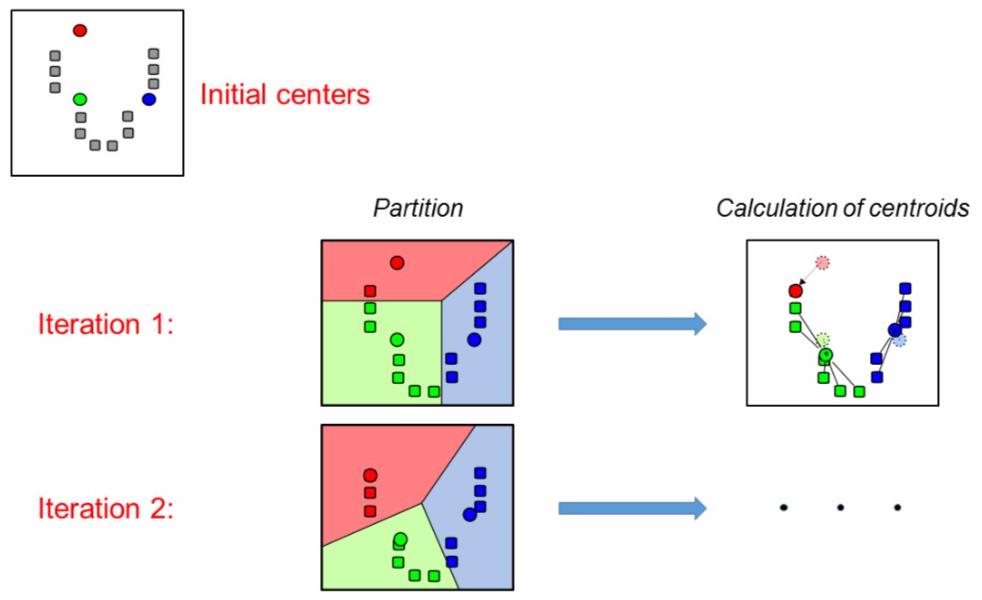

$\bold{\text{Theorem}}$ 

*The Lloyd’s algorithm always terminates.*

$\bold{\text{Proof}}$

Let $\mathcal{C_t}$ be the $k$-clustering computed by the algorithm in Iteration $t\ge1$ of the while loop (line 7). We have:

- By construction, the objective function values $\Phi_{kmeans}(\mathcal{C}_t)$’s, for every $t$ except for the last one, form a strictly decreasing sequence. Also, in the last iteration (say Iteration $t^*$) $\Phi_kmeans(\mathcal{C}_{t^*}) = \Phi_{kmeans}(\mathcal{C}_{t^*-1})$, since the invocation of Partition and the subsequent recompilation of the centroids in this iteration cannot increase the value of the objective function.
- Each $\mathcal{C}_t$ is uniquely determined by the partition of $P$ into $k$ clusters computed at the beginning of iteration $t$.
- By the above two points we conclude that all $\mathcal{C}_t$’s, except possibly the last one, are determined by distinct partition of $P$.

The theorem follows immediately since there are $k^N$ possible partitions of $P$ into $\le k$ clusters (counting also permutation of the same partition).

#### Observations

1. Lloyd’s algorithm may be trapped into a local optimum whose value of the objective function can be much larger than the optimal value. Hence, no guarantee can be proved on its accuracy. Consider the following example and suppose that $k = 3$.

   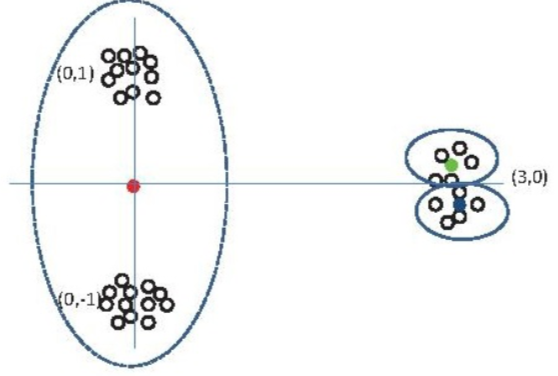

   If initially one center falls among the points on the left side, and two centers fall among the points on the right side, it is impossible that one center moves from right to left, hence the two obvious clusters on the left will be considered as just one cluster.

2. While the algorithm surely terminates, the number of iterations can be exponential in the input size. 

3. Besides the trivial $k^N$ **upper bound** on the number of iterations, more sophisticated studies proved an $O(􏰊N^{kD})$ **􏰋 upper bound** which improves upon the trivial one, in scenarios where $k$ and $D$ are small.

4. Some recent studies proved also a $2^{\Omega(\sqrt N)}$ **lower bound** on the number of iterations in the worst case.

5. mprical studies show that, in practice, the algorithm requires much less than N iterations, and, if properly seeded (see next slides) it features guaranteed accuracy. 

6. Despite the not so promising theoretical results, empirical studies show that**, in practice, the algorithm requires much less than $N$ iterations**, and, if properly seeded it features guaranteed accuracy. 

7. To improve performance, with a limited quality penalty, one could stop the algorithm earlier, e.g., when the value of the objective function decreases by a small additive factor. 

#### Effective initialization

The quality of the solution and the speed of convergence of Lloyd’s algorithm depend considerably from the choice of the initial set of centers (e.g., consider the previous example). Typically initial centers are chosen at random, but there are more effective ways of selecting them.

In 2007, D. Arthur and S. Vassilvitskii developed **k-means++**, a careful center initialization strategy that yields clusterings not too far from the optimal ones.  

### K-means++

Let $P$ be a set of $N$ points from $\R^D$, and let $k>1$ ne an integer.

The **K-means++ algorithm** computes a (initial) set $S$ of $k$ centers for $P$ using the following procedure (note that $S \sube P$):
$$
\begin{multline*}
\begin{aligned}
& \bold{\text{K-means++(P, k)}}\\
1.\ & c_1\larr \text{random point chosen from}\ P\text{ with uniform probability } \R^D\\
2.\ & S \larr \{c_1\}\\
3.\ & \bold{\text{for }} i\larr 2 \bold{\text{ to }} k \bold{\text{ do }}\\
4.\ &\quad c_i \larr \text{random point chosen from  } P-S \text{, where a point } p\\ 
&\quad\quad\quad\ \text{is chosen with probability} \quad\frac{(d(p,S))^2}{\sum_{q \in P-S}(d(q,S))^2}\\
5.\ &\quad S \larr S \cup \{c_i\}\\
6.\ &\bold{\text{return}}\ S
\end{aligned}
\end{multline*}
$$
**Observation**:

Although k-means++ already provides a good set of centers for the k-means problem (see next theorem) it can be used to provide the initialization for Lloyd’s algorithm, whose iterations can only improve the initial solution.

#### Details on the selection of $c_i$

Consider iteration $i $ of the for loop of k-means++ ($i\ge2$)      

Let $S$ be the current set of $i-1 $ already discovered centers.

- Let $P-S=\{p_j : 1 \le j \le |P-S|\}$ (arbitrary order), and define $\pi_j = (d(p_j,S))^2/(\sum_{q \in P-S}(d(q,S))^2)$. Note that the $\pi_j$’s define a probability distribution, that is, $\sum_{j\ge1}\pi_j = 1$.

- Draw a random number $x \in [0,1]$ and set $c_i = p_r$, where $r$ is the unique index between $1$ and $|P-S|$ such that
  $$
  \sum_{j=1}^{r-1}\pi_j \le x 
  \le \sum_{j=1}^{r}\pi_j
  $$
  

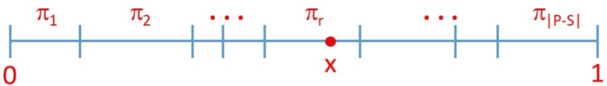

#### Analysis

$\bold{\text{Theorem (Arthur-Vassilvitskii ‘07)}}$

*Let $\Phi_{kmeans}^{opt}(k)$ be the minimum value o f $\Phi_{kmeans}(\mathcal{C})$ over all possible $k$-clustering $\mathcal{C}$ of $P$, and let $\mathcal{C}_{alg} = \text{Partition(P,S)}$ be the $k$-clustering of $P$ induced by the set $S$ of centers returned by the **k-means++**. Note that $\mathcal{C}_{alg}$ is a random variable which depends on the random choices made by the algorithm. Then:*
$$
E[\Phi_{kmeans}(\mathcal{C}_{alg})] \le 8(\ln k +2)
\cdot \Phi_{kmeans}^{opt}(k)
$$
*Where the expectation is over all possible sets $S$ returned by k-means++, which depend on the random choices made by the algorithm.*

**Remark:** There exist a sequential constant-approximation algorithm that runs in cubic time for points in $\R^D$ with constant $D$, however it is impractical for large datasets.

### Core-set-based approach for k-means

We study a **core-set-based approach** similar to the one used for k-center

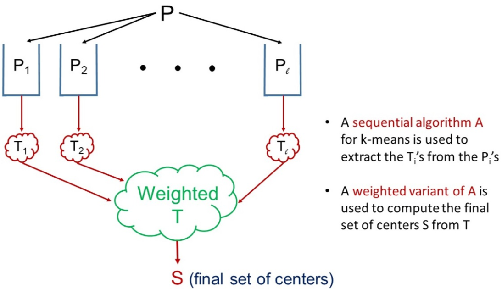

### Weighted k-means clustering

One can define the following, more general,  **weighted variant of the k-means clustering** problem.

Let $P$ be a set of $N$ points from a metric space $(M,d)$, and let $k$ be an integer in $[1,N]$. Suppose that for each point $p \in P$, an integer weight $w(p)>0$ is also given. We want to compute the $k$-clustering $\mathcal{C} = (C_1,C_2,\dots,C_k; c_1,c_2,\dots,c_k)$ of $P$ which minimizes the following objective function:
$$
\Phi^w_{kmeans}(\mathcal{C}) = \sum^k_{1=1}\sum_{p \in C_i} w(p) \cdot (d(p, c_i))^2
$$
That is, the average weighted squared distance of a point from its cluster center.

**Observation:** the unweighted k-means clustering problem Is a space case of the weighted variant where all weights are equal to 1.

Most of the algorithms known for the standard k-means clustering problem can be adapted to solve the weighted variant. It is sufficient to **regard each point $p$ as representing $w(p)$ identical copies of itself**. The same approximation guarantees are  maintained.

For example:

**Lloyd’s algorithm:** remains virtually identical except that:

- The centroid of a cluster $C_i$ is defined as $(1/\sum_{p \in C_i} w(p)) \sum_{p \in C_i} w(p) \cdot p$
- The objective function $\Phi ^w_{means}(\mathcal{C})$ is used.

**K-means++:** remains virtually identical except that the selection of the $i$-th center $c_i$ is now done as follows:

$c_i \larr \text{random point chosen from } P-S, \text{where a point } P \\ \quad\quad\  \text{is chosen with probability } w(p) \cdot (d(p, S)) ^2 / \sum_{q \in P-S} (w(p) \cdot (d(q,S))^2)$

### Core-set-based MapReduce algorithm for k-means

The following MapReduce algorithm implements the corset-based approach for k-means-

Let $\mathcal{A}$ be your favorite sequential algorithm for k-means, and denote its weighted variant with $\mathcal{A}^w$.

- Round 1: Partition $P$ arbitrarily in $\ell$ subsets of equal size $P_1,P_2, \dots, P_\ell$ and execute $\mathcal{A}$ independently on each $P_i$. For $1 \le i \le \ell$, let $T_i$ be the set of $k$ centers computed by $\mathcal{A}$ on $P_i$. For each $p \in P_i$ define its *proxy* $\pi(p)$ as its closest center in $T_i$, and for each $q \in T_i$, define tis *weight* $w(q)$ as the number of points of $P_i$ whose proxy is $q$.
- Round 2: Gather the **core-set** $T = \bigcup^\ell_{i = 1} T_i$ for $\ell \cdot k$ points, together with their weights. Using a single reducer, run $\mathcal A^w$ on $T$ to identify a set $S = \{c_1,c_2,\dots,c_k\}$ of $k$ centers.
- Round 3: Run $\text{Partition(P,S)}$ to return the final clustering.

Let us call the algorithm: $\text{MR-kmeans}(\mathcal{A}, \mathcal{A}^w)$.

#### Analysis

Assume $k = o(N)$. By setting $\ell = \sqrt{N/k}$, it is easy to see that the 3-round $\text{MR-kmeans}(\mathcal{A},\mathcal{A}^w)$ algorithm can be implemented using:

- Local space $M_L = O(\sqrt{N \cdot k}) = o (N)$
- Aggregate space $M_A = O(N)$

The quality of the solution returned by the algorithm is stated in the following theorem.

$\bold{\text{Theorem}}$

*Suppose that $\mathcal{A}$ (resp., $\mathcal{A}^w$) is an $\alpha$-approximation algorithm for the k-means clustering (resp. Weighted k-means clustering), for some $\alpha > 1$, and let $\mathcal{C}_{alg}$ be the $k$-clustering of $P$ returned by $\text{MR-kmeans} (\mathcal{A},\mathcal{A}^w)$. Then:*
$$
\Phi_{kmeans}(\mathcal{C}_{alg}) \le
(6\alpha + 4\alpha^2)\cdot \Phi_{kmeans}^{opt} (P,k)
$$
*That is, $\text{MR-kmeans} (\mathcal{A},\mathcal{A}^w)$ is a $(6\alpha + 4\alpha^2)$-approximation algorithm.*

$\bold{\text{Definition}}$

Given a point-set $P$, a core-set $T \sube P$ and a proxy function $\pi : P \rarr T$, we say that $T$ is a **$\bold{\gamma}$-core-set** for $P$, $k$ and the k-means objective if
$$
\sum_{p \in P}(d(p, \pi(p)))^2 \le \gamma \cdot \Phi^{opt}_{kmeans}(P,k)
$$
**Remark:** intuitively, the smaller $\gamma$, the better $T$ (together with the proxy function) represents $P$ with respect to the k-means clustering problem, and it is likely that a good solution for the problem can be extracted from $T$, by weighing each point of $T$ with the number of points for which it acts as proxy.

The following lemma relates the quality of the solution returned by $\text{MR-kmeans} (\mathcal{A},\mathcal{A}^w)$ to the quality of the core-set $T$ and to the approximation guarantee of $\mathcal{A}^w$.

$\bold{\text{Lemma 1}}$

Suppose that the core-set $T$ computed in Round 1 of $\text{MR-kmeans} (\mathcal{A},\mathcal{A}^w)$ is a $\gamma$-core-set and that $\mathcal{A}^w$ is an $\alpha$-approximation algorithm for weighted k-means clustering, for some $\alpha > 1$. Let $\mathcal C_{alg}$ be the $k$-clustering of $P$ retuned by $\text{MR-kmeans} (\mathcal{A},\mathcal{A}^w)$. Then:
$$
\Phi_{kmeans}(\cal C_{alg}) \le 
4\alpha + \gamma \cdot (2+4\alpha)
$$
**Remark:** The lemma implies that by choosing a $\gamma$-core-set with small $\gamma$, the penalty in accuracy incurred by the MapReduce algorithm with respect to the sequential algorithm is small. This shows that accurate solutions even in the big data scenario can be computed.

$\bold{\text{Lemma 2}}$

If $\cal A$ is an $\alpha$-approximation algorithm for k-means clustering, then the core-set $T$ computed in Round 1 of $\text{MR-kmeans} (\mathcal{A},\mathcal{A}^w)$ is a $\gamma$-core-set with:
$$
\gamma = \alpha
$$
$\bold{\text{Proof}}$

Let $S^{opt}$  be the set of optimal centers for $P$ (i.e, those of the clustering with value of the objective function $\Phi^{opt}_{kmeans}(P,k)$). Let also $S_i^{opt}$ be the set of optimal centers for $P_i$.

Recall that for every $1 \le i\le \ell$, for each $p \in P_i$ its proxy $\pi(p)$ is the point of $T_i$ closest to $p$, thus $d(p, \pi(p)) = d(p, T_i)$.

Hence, we have:
$$
\begin{align}
\sum_{p \in P}d^2(p, \pi(p)) &=
\sum_{i = 1}^\ell\sum_{p \in P_i}(d(p, T_i))^2\\
&\le\sum_{i = 1}^\ell \alpha \sum_{p \in P_i}(d(p, S_i^{opt}))^2\\
&\le\alpha \sum_{i = 1}^\ell \sum_{p \in P_i}(d(p, S_i^{opt}))^2\\
&=\alpha \sum_{p \in P_i}(d(p, S_i^{opt}))^2
= \alpha \Phi^{opt}_{kmeans}(P,k)\\
\end{align}
$$
(40) follow since $\cal A$ is an $\alpha$-approximation algorithm;

(41) follow since $S^{opt}$ Is not necessarily optimal for $P_i$.

□

 $\bold{\text{Proof of Theorem}}\ (35)$

The theorem is an immediate consequence of Lemmas 1 and 2.

□

**Observations:**

- A more careful analysis shows that the constants in the approximation factor of $\text{MR-kmeans} (\mathcal{A},\mathcal{A}^w)$ are actually lower.
- If $k’ > k$ centers are selected from each $P_i$ in Round 1 (e.g.  by executing) $k’$ iterations of the for-loop of k-means++, the quality of the core-set $T$ improves. In fact, for low dimensional spaces, a $\gamma$-core-set $T$  with $\gamma \ll \alpha$ can be built in this fashion using a not too large $k’$.
- If a $\gamma$-core-set $T$ with very small $\gamma$ is used, the approximation guarantee of $\text{MR-kmeans} (\mathcal{A},\mathcal{A}^w)$ become close to $4\alpha$.

## K-median clustering

### Definition and observations

Given a point-set $P$ from a metric space $(M, d)$ and an integer $k > 0$, the k-median clustering problem requires to determine a $k$-clustering $\cal C = (C_1,C_2, \dots, C_k; c_1,c_2, \dots, c_k)$ which minimizes:
$$
\Phi_{kmedian}(\mathcal{C}) = \sum_{i = 1}^{k}
\sum_{a \in C_i} d(a, c_i)
$$
**Our aim:**

- Unlike the case of k-means clustering, for k-median we will focus on the case where points belong to arbitrary metric spaces, but the **centers belong to the input point-set.**
- Traditionally, when centers of the clusters belong to the input they are referred to as **medoids**. 
- We will first study the popular PAM sequential algorithm devised by L. Kaufman and P.J. Rousseeuw in 1987 and based on the **local search** optimization strategy. Then, we will discuss how to cope with very large inputs.  

###							 						 					 				 			 	Partitioning Around Medoids (PAM) algorithm

$\bold{\text{Input}}$ Set $P$ of $N$ points from $(M, d)$, integer $k > 1$

$\bold{\text{Output}}$ $k$-clustering $\mathcal C = (C_1,C_2, \dots, C_k; c_1,c_2, \dots, c_k)$ of $P$ with small $\Phi_{kmedian}(\cal C)$.
$$
\begin{multline*}
\begin{aligned}
& \bold{\text{PAM(P, k)}}\\
1.\ & S\larr \{c_1,c_2,\dots,c_k\}\text{ (arbitrary set of}\ k \text{ points of } P \text{)}\\
2.\ & \cal C \larr \text{Partition(P,S)}\\
3.\ & \text{stopping-condition } \larr \text{false} \\
4.\ &\bold{\text{while}} \text{ (!stopping-condition)} \bold{\text{ do}}\\
5.\ &\quad \text{stopping-condition} \larr \text{true}\\
6.\ &\quad \bold{\text{for each }} p \in P-S \bold{\text{ do }}\\
7.\ &\quad\quad \bold{\text{for each }} c \in S \bold{\text{ do }}\\
8.\ &\quad\quad\quad S' \larr (S - \{c\})\cup \{p\} \\
9.\ &\quad\quad\quad \mathcal C' \larr \text{Partition(P,S)} \\
10.\ &\quad\quad\quad \bold{\text{if }} \Phi_{kmedian}(\mathcal{C'}) < \Phi_{kmedian}(\mathcal{C}) \bold{\text{ then }}\\
11.\ &\quad\quad\quad\quad \text{stopping-condition } \larr \text{false} \\
12.\ &\quad\quad\quad\quad \cal C \larr \cal C'\\
13.\ &\quad\quad\quad\quad S \larr S'\\
14.\ &\quad\quad\quad\quad \text{exith both for-each loops}\\
15.\ &\bold{\text{return}}\ \cal C
\end{aligned}
\end{multline*}
$$
**Example:**

| 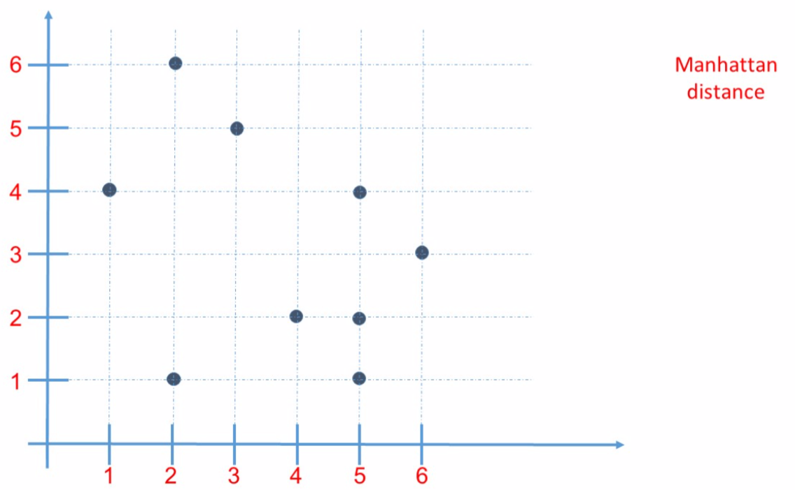 | 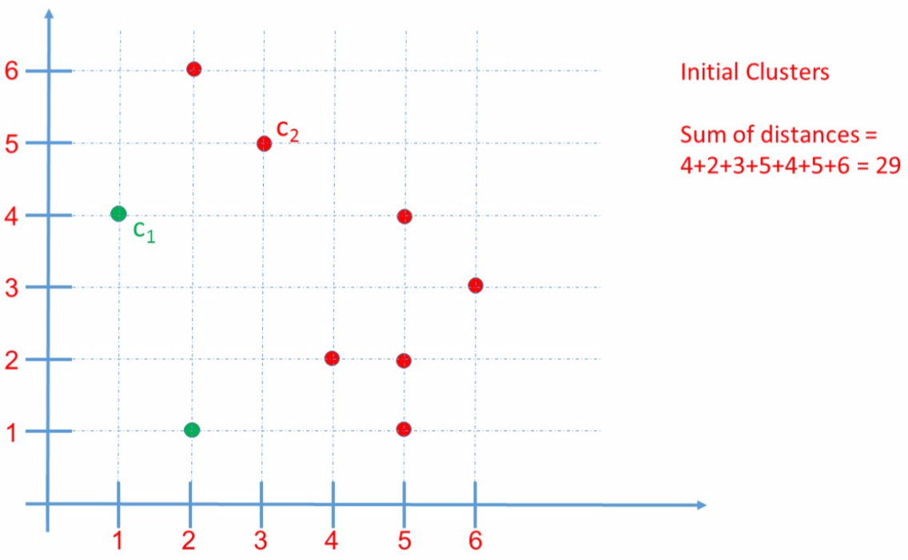 |
| ---------------------- | ---------------------- |
| 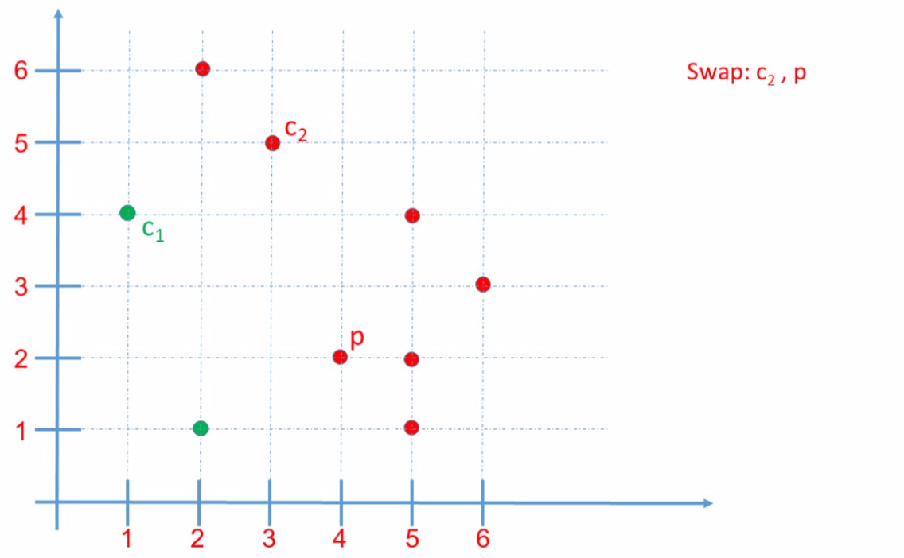 | 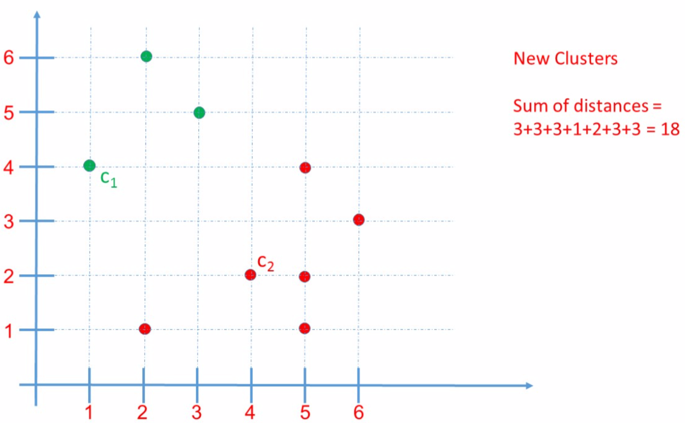 |
| 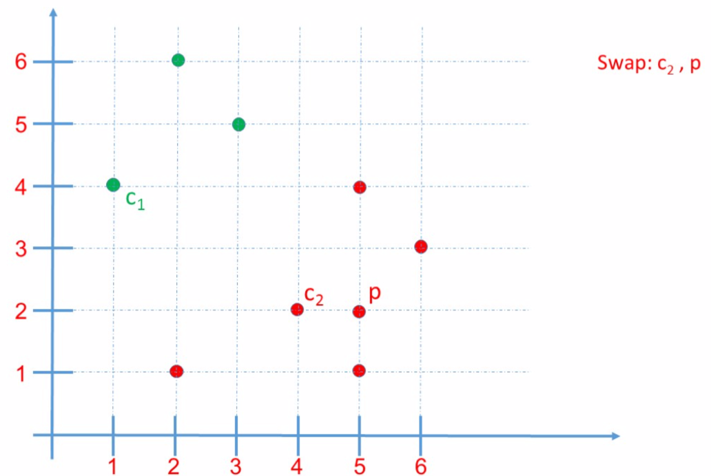 |  |
| 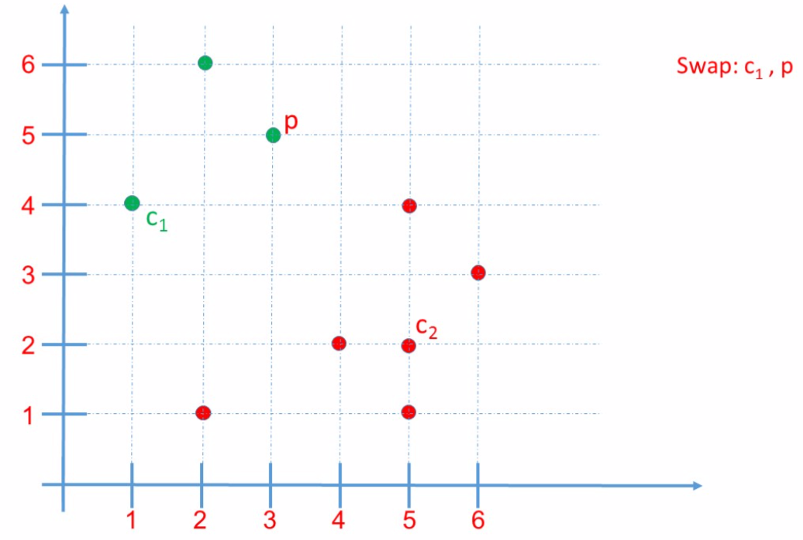 | 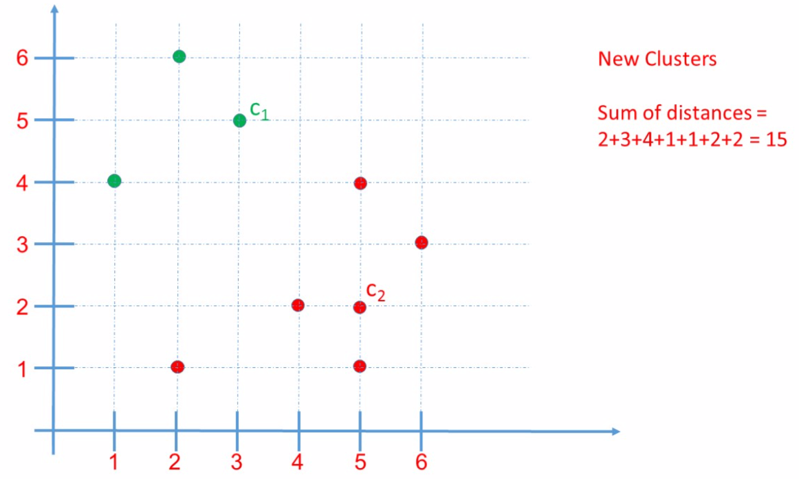 |

$\bold{\text{Theorem}}$

Let $\Phi^{opt}_{kmedian}(k)$ be the minimum value of $\Phi_{kmedian}(\cal C)$ over all possible $k$-clustering $\cal C$ of $P$, and let $\mathcal C_{alg}$ be the $k$-clustering of $P$ returned by the PAM algorithm. Then:
$$
\Phi_{kmedian}(\mathcal C_{alg}) \le 5\cdot\Phi_{kmedian}^{opt} (k)
$$

#### Remarks

- The PAM algorithm is **very slow in practice** especially for large inputs since: (1) the local search may require a large number of iterations to converge; and (2) in each iteration up to $(N − k) · k$ swaps may need to be checked, and for each swap a new clustering must be computed. 
- The first issue can be tackled by **stopping the iterations when the objective function does not decrease significantly**. It can be shown that an approximation guarantee similar to the one stated in the theorem can be achieved with a reasonable number of iterations. 
- A faster alternative to PAM is an adaptation of the Lloyd’s algorithm where the center of a cluster $C$ is defined to be the point of $C$ that minimizes the sum of the distances to all other points of C. This center is called medoid rather than centroid. This adaptation appears faster than PAM and still very accurate in practice.

### k-median clustering for big data

The solution of the k-median clustering problem on very large point sets $P$ can be attained using the same core-set-based approach illustrated for the case of k-means.

- Define the weighted variant of the problem where each point $p \in P$ has a weight $w(p)$  and the objective function for a $k$-clustering $\mathcal C = (C_1,C_2, \dots, C_k; c_1,c_2, \dots, c_k)$ is 
  $$
  \Phi_{kmedian}^w(\mathcal C) = 
  \sum_{i = 1}^k\sum_{p \in C_i} w(p)\cdot d(p,c_i)
  $$

- Select your favorite sequential algorithm $\cal B$ and its weighted counterpart $\cal B^w$.

- Select a weighted core-set $T$ by running $\cal B$ independently on the subset of a partition of $P$ and extract the final set of centers from $T$ using $\cal B^w$.

- Run $\text{Partition(P,S)}$

### MR-kmedian$(\cal B, B^w)$

The MapReduce implementation of the above strategy, which we call $\text{MR-kmedian}\cal(B,B^w)$, is identical to the one we saw before, except that $\cal A$ and $\cal A^w$ are replaced by $\cal B$ and $\cal B^w$.

$\text{MR-kmedian}\cal(B,B^w)$ Requires 3 rounds, local space $M_L = O(\sqrt{N \cdot k})$, and aggregate space $M_A = O(N)$, where $N$ is the input size. Moreover, the following theorem can be proved.

$\bold{\text{Theorem}}$

*Suppose that $\cal B$ (resp., $\cal B^w$) is an $\alpha$-approximation algorithm for k-median clustering (resp. weighted k-median clustering), for some $\alpha > 1$, and let $\cal C_{alg}$ be the $k$-clustering of $P$ returned by$ \text{MR-kmedian}\cal(B,B^w) $. Then:*
$$
\Phi_{kmedian}(\mathcal C_{alg}) =
O(\alpha^2 \Phi^{opt}_{kmedian}(P,k))
$$
*That is, $\text{MR-kmedian}\cal(B,B^w)$ is a $O(\alpha^2)$-approximation algorithm.*

